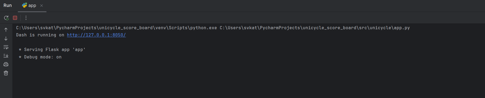
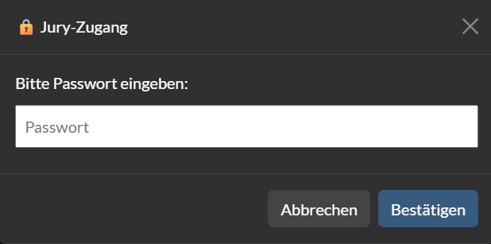

# Einrad-Dashboard

  🇬🇧 <a href="README.md">English</a> |
  🇩🇪 <a href="README.de.md">Deutsch</a>

## Projektbeschreibung
Das Einrad-Dashboard ist ein Softwaretool zur Visualisierung und Verwaltung von Wettkampfdaten im Einradsport. Es integriert Daten aus Datenbanken und stellt sowohl eine Teilnehmerübersicht als auch eine Juryübersicht bereit.

Die Teilnehmerübersicht ermöglicht die Anzeige relevanter Informationen über die Teilnehmenden und ihre Kürprogramme. In der Juryübersicht können Jurymitglieder die Punkte für jede einzelne Kür eingeben. Die Gesamtpunktzahl pro Kür wird automatisch berechnet und interaktiv aktualisiert. 

## Projektumfang und Zielsetzung
- [x] Datenbanken aus .xlsx-Dateien zur Speicherung von Teilnehmer- und Kürdaten erstellen.
- [x] Teilnehmer- und Juryübersichten basierend auf Datenbankdaten bereitstellen.
- [x] Punkteingabe durch Jury mit automatischer Gesamtpunktberechnung ermöglichen.
- [x] Zugriff auf Juryübersicht durch verschlüsselte Passwortauthentifizierung sichern.

## Einrichtung

    git clone https://github.com/isabelbroeder/unicycle_score_board.git
    cd unicycle_score_board
    python3 -m venv venv
    pip install -r requirements.txt

## Verwendung

Wir empfehlen dringend, einen Python-Interpreter zu verwenden (vorzugsweise PyCharm, da der Code damit entwickelt wurde), um Fehler zu vermeiden.

1. Speichern Sie alle Anmelde-Dateien im Ordner `data/registration_files` 

2. Führen Sie `src/unicycle/create_database.py` aus, um die Datenbanken `riders.db`, `routines.db` und `riders_routines.db` zu erstellen, welche notwendige Daten für `app.py` enthalten. Außerdem wird eine Startliste erstellt und unter `output/starting_order.xlsx` gespeichert.

3. Führen Sie `src/unicycle/app.py` aus. 

4. Nach dem Ausführen erscheint in der Konsole ein Link. Klicken Sie auf diesen Link, um das Dashboard zu öffnen.

      
   

5. Das Dashboard öffnet sich standardmäßig mit der Teilnehmerübersicht. Unterhalb der Tabellenüberschrift ist ein Filter integriert, mit dem jede Spalte einzeln gefiltert werden kann. (Der gleiche Filter kann auch in der Juryansicht verwendet werden.)

6. Verwenden Sie den Schalter oben links, um zwischen Dark Mode und Light Mode zu wechseln.

     

7. Klicken Sie oben rechts auf die Schaltfläche „Jury Ansicht“. Geben Sie das Passwort im Pop-up-Fenster ein. Das Passwort lautet `test`. (Sehr kreativ, wissen wir ...)

    

8. In der Juryansicht können Sie Punkte für jede Kür eingeben. Die Gesamtpunktzahl wird automatisch berechnet.

9. Die vollständige Punktetabelle wird automatisch in der Datenbank `points.db` gespeichert.

## Einrad-Bewertungssystem

1. Kategorien

- Einzel, Paar, Kleingruppe, Großgruppe
- Kleingruppen bestehen aus 3–8 Fahrer:innen
- Großgruppen bestehen aus 9 oder mehr Fahrer:innen
- Einzelküren werden nach Geschlecht getrennt, Paarküren nicht

2. Altersklassen

- Das Alter der ältesten Person in einer Kür bestimmt die Altersklasse, in der die Kür startet
- Die Altersklassen hängen vom jeweiligen Wettbewerb ab (und von der Anzahl der Küren pro Altersklasse)
- Die Altersklasse U13 umfasst alle Fahrer:innen unter 13 Jahren (entsprechend auch U15); die Altersklasse 15+ umfasst alle Fahrer:innen ab 15 Jahren

3. Jury

- Jede Kür wird von einer Jury bewertet, die aus mehreren Wertungsrichter:innen besteht.
- Vier Wertungsrichter:innen für Technik und Performance
- Einzel- und Paarküren haben zwei Abstiegszähler:innen, Klein- und Großgruppen vier
- Die Wertungsrichter:innen werden fortlaufend nummeriert: T1, T2, …, P1, P2, …, D1, D2, …
- Technik- und Performance-Wertungsrichter:innen können in drei Kategorien jeweils 0 bis 10 Punkte vergeben (mit beliebig vielen Dezimalstellen, üblicherweise ein oder zwei)
  - Technik-Kategorien: Anzahl der Einrad-Elemente und Übergänge, Beherrschung und Qualität der Ausführung, Schwierigkeit und Dauer
  - Performance-Kategorien: Präsenz/Ausführung, Komposition/Choreografie, Interpretation der Musik/Timing
- Bei Abstiegen wird zwischen leichten und schweren Abstiegen unterschieden

## Weiterführende Ideen

Mit noch mehr Zeit hätten die folgenden Ideen ebenfalls berücksichtigt werden können:

- Punkte der Teilnehmenden auf der Teilnehmerseite zusammen mit einer Rangliste anzeigen.  
- Auswahl bestimmter Jurymitglieder für Bewertung oder Übersicht ermöglichen, jeweils mit individuellem Passwort.