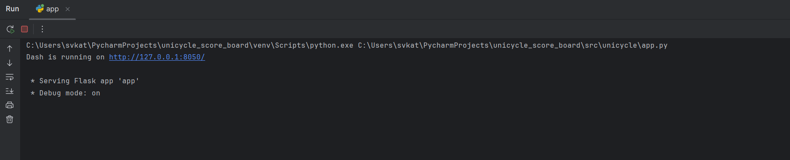
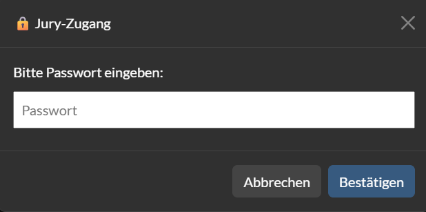

# Unicycle Dashboard

  🇬🇧 <a href="README.md">English</a> |
  🇩🇪 <a href="README.de.md">Deutsch</a>

## Project Description
The Unicycle Dashboard is a software tool designed to visualize and manage competition data for unicycle events. It integrates data from databases to provide both a participant overview and a jury overview.

The participant overview allows users to view relevant information about competitors and their routines. The jury overview enables jury members to enter scores for each individual routine. The total score per routine is calculated automatically and updated interactively.

## Project Scope and Goals
- [x] Create databases from .xlsx files to store participant and routine information.
- [x] Provide participant and jury overviews using integrated database data.
- [x] Allow jury members to enter scores with automatic total calculation.
- [x] Secure jury overview access using encrypted password authentication.

## Installation

    git clone https://github.com/isabelbroeder/unicycle_score_board.git
    cd unicycle_score_board
    python3 -m venv venv
    pip install -r requirements.txt

## Usage

We strongly suggest to use a python interpreter (preferably PyCharm, because the code was developed using it) to prevent any errors.

0. Run `src/unicycle/create_database.py` to create the databases `riders.db`, `routines.db`, and `riders_routines.db`, which include necessary data for `app.py`.

1. Run `src/unicycle/app.py`.

2. A link will appear in the console. Click on the link to access the dashboard.

    

3. The dashboard opens with the participant overview as the default page.

4. Use the switch in the top left corner to toggle between dark and light mode.

     

5. Click the "Jury Ansicht" button in the top right corner. Enter the password in the popup window.

    

6. In the jury view, you can enter scores for each routine. Total scores are calculated automatically.

7. The complete scoreboard is automatically saved in the database `points.db`.

## Unicycle Scoring System

1. Categories

- Individual, pair, small group, large group
- Small groups consist of 3-8 riders
- Large groups consist of 9 or more riders
- Individual routines are separated by gender, pair routines not

2. Age groups 
- Age of the oldest rider in a routine determines the age group in which the routine starts
- Age groups depend on the competition (and the number of routines per age group)
- U13 age group includes all riders younger than 13 (similar for U15), the 15+ age group includes all riders 15 years of age or older

3. Jury
- Each routine is judged by a jury consisting of several judges.  
- Four judges for technique and performance
- Individual and pair routines have two dismount counters, small and large groups have four
- Judges are numbered consecutively from T1, T2, ..., P1, P2, ..., D1, D2, ...
- Technique and performance judges can award points from 0 to 10 in three categories (with any number of decimal places, but usually only one or two)
  - Technique categories: Quantity of unicycle skills and transitions, Mastery and quality of execution, Difficulty and duration
  - Performance categories: Presence/execution, composition/choreography, interpretation of the music/timing
- For dismounts, a distinction is made between minor dismounts and major dismounts 

## Further Ideas

With more time, the following ideas could have been considered as well:

- Show participants points along with a ranking on the participant page.
- Allow selecting specific judges for scoring or review with individual passwords.

